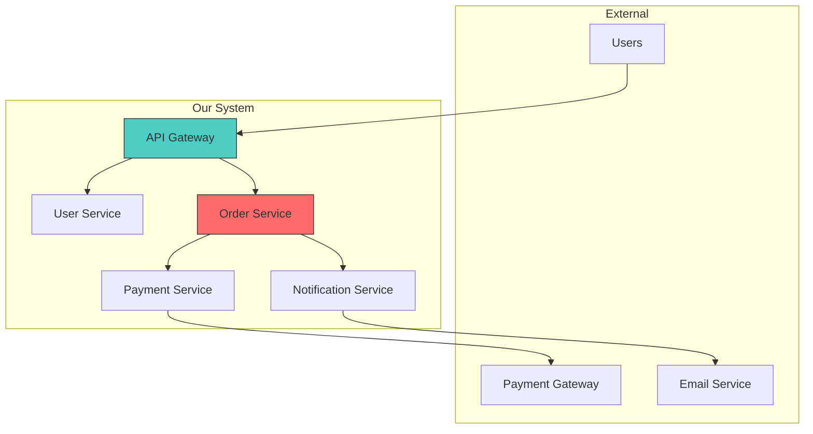
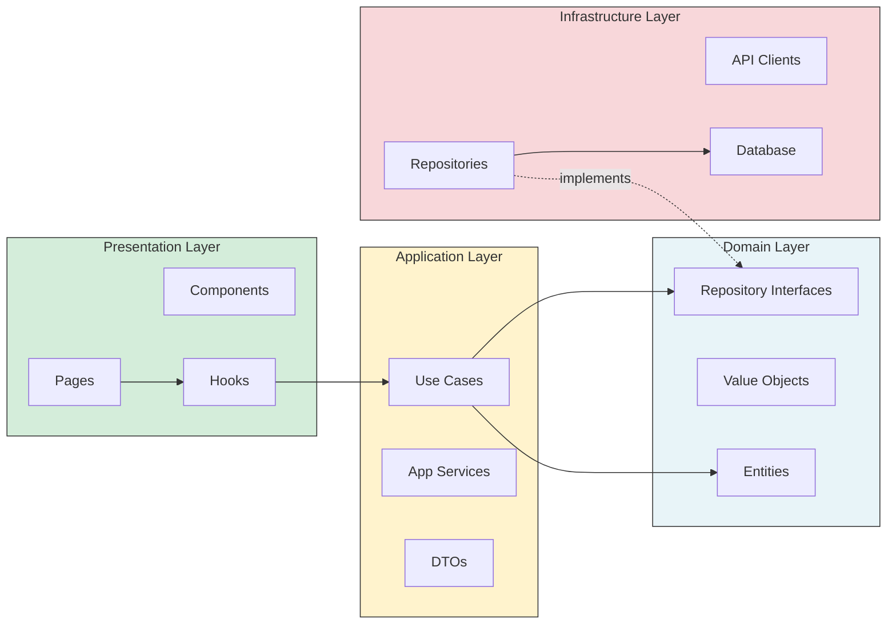

# atlas — Canvas/Zen 連携テンプレ (reference)

> Progressive Disclosure: SKILL.md から抽出 (ARIS-1577 #2)。必要時に Read する。

## CANVAS_REQUEST

### Diagram Type: Component Diagram (C4 Level 3)
### Purpose: Show internal components and dependencies

### Components
1. API Gateway - Entry point, auth, rate limiting
2. User Service - User management, authentication
3. Order Service - Order processing, status management
4. Payment Service - Payment processing, refunds
5. Notification Service - Email, push notifications

### Dependencies
- API Gateway → [User Service, Order Service]
- Order Service → [Payment Service, Notification Service]
- Payment Service → External Payment Gateway
```

### Dependency Graph

```markdown
## CANVAS_REQUEST

### Diagram Type: Dependency Graph
### Purpose: Visualize module dependencies and identify issues

### Modules
- @app/auth → [@app/shared, @app/api]
- @app/orders → [@app/auth, @app/products, @app/shared]
- @app/products → [@app/shared]
- @app/shared → (no dependencies)

### Issues to Highlight
- Circular: @app/orders ↔ @app/products (if exists)
- God module: @app/shared (too many dependents)
```

### Migration Roadmap

```markdown
## CANVAS_REQUEST

### Diagram Type: Timeline / Gantt
### Purpose: Show migration phases and milestones

### Phases
1. Phase 1 (Week 1-2): Setup new structure
2. Phase 2 (Week 3-4): Migrate auth module
3. Phase 3 (Week 5-6): Migrate orders module
4. Phase 4 (Week 7-8): Cleanup and validation

### Milestones
- M1: New folder structure created
- M2: Auth module migrated, old code deprecated
- M3: All modules migrated
- M4: Old code removed, migration complete
```

### Mermaid Examples for Self-Generation





---

## ZEN INTEGRATION

When architectural issues require code refactoring, hand off to Zen agent.

### God Class Split Request

```markdown
## ZEN_HANDOFF

### Task: God Class Refactoring
- File: `src/services/UserService.ts`
- Lines: 2,500+
- Issue: Single class handling auth, profile, preferences, notifications

### Proposed Split
1. `UserAuthService` - login, logout, token management
2. `UserProfileService` - profile CRUD, avatar
3. `UserPreferencesService` - settings, notifications
4. `UserNotificationService` - email prefs, push settings

### Constraints
- Maintain backward compatibility
- Keep public API unchanged initially
- Add deprecation warnings for old imports

### Dependencies to Consider
- 45 files import UserService
- Used in 12 React components
- 3 API routes depend on it
```

### Responsibility Separation Request

```markdown
## ZEN_HANDOFF

### Task: Separate Mixed Responsibilities
- File: `src/components/OrderPage.tsx`
- Issue: Component handles UI, API calls, state management, and business logic

### Current State
```typescript
// Everything in one component
function OrderPage() {
  const [orders, setOrders] = useState([]);
  const [loading, setLoading] = useState(false);

  // API call
  const fetchOrders = async () => { ... };

  // Business logic
  const calculateTotal = () => { ... };

  // UI rendering
  return <div>...</div>;
}
```

### Desired State
- Custom hook for data fetching: `useOrders()`
- Utility for calculations: `orderUtils.ts`
- Pure UI component: `OrderPage.tsx`

### Acceptance Criteria
- Component under 100 lines
- Logic testable independently
- No direct API calls in component
```

### Coupling Reduction Request

```markdown
## ZEN_HANDOFF

### Task: Reduce Coupling Between Modules
- Modules: `orders` and `inventory`
- Issue: Direct imports create tight coupling

### Current State
```typescript
// orders/OrderService.ts
import { InventoryRepository } from '../inventory/InventoryRepository';
import { StockChecker } from '../inventory/StockChecker';
import { ReservationManager } from '../inventory/ReservationManager';
```

### Desired State
- Define interface in orders module
- Inventory module implements interface
- Dependency injection at composition root

### Interface to Create
```typescript
// orders/ports/InventoryPort.ts
interface IInventoryPort {
  checkStock(productId: string): Promise<number>;
  reserve(productId: string, quantity: number): Promise<void>;
  release(reservationId: string): Promise<void>;
}
```
```

---

