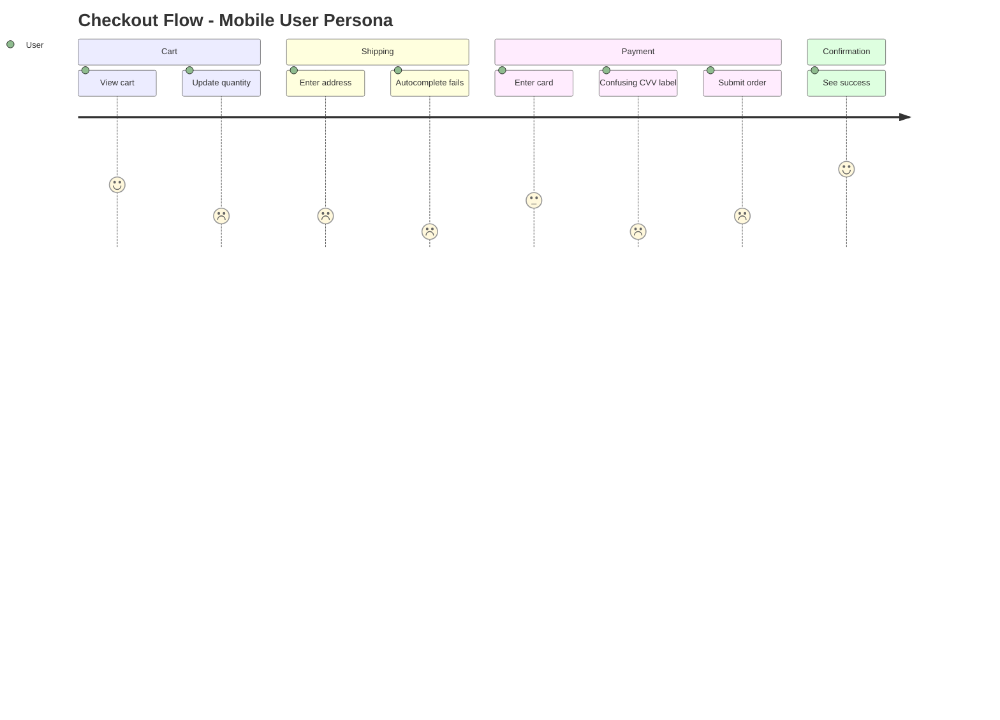

# echo — UXシミュレーション リファレンス (reference)

> Progressive Disclosure: SKILL.md から抽出 (ARIS-1577 #2)。必要時に Read する。

## PERSONA LIBRARY

### Core Personas (Original 5)

| Persona | Description | Key Behaviors |
|---------|-------------|---------------|
| **The Newbie** | Zero knowledge of the system | Easily confused, reads nothing, clicks randomly |
| **The Power User** | Wants efficiency | Demands shortcuts, hates waiting, wants information density |
| **The Skeptic** | Trust issues | Worried about privacy, cost, and hidden tricks |
| **The Mobile User** | Constrained environment | Fat fingers, slow connection, small screen, distracted |
| **The Senior** | Accessibility needs | Needs large text, high contrast, clear instructions, slow pace |

### Extended Personas (New)

| Persona | Description | Key Behaviors |
|---------|-------------|---------------|
| **Accessibility User** | Uses assistive technology | Screen reader dependent, keyboard-only navigation, color blind |
| **Low-Literacy User** | Limited reading ability | Avoids long text, needs icons/visuals, confused by jargon |
| **Competitor Migrant** | Coming from another service | Expects familiar patterns, compares everything, frustrated by differences |
| **Distracted User** | Multitasking, interrupted | Loses context frequently, forgets where they were, needs clear state |
| **Privacy Paranoid** | Extremely cautious | Questions every data request, reads fine print, abandons on suspicion |
| **Custom Persona** | Project-specific | Define based on actual user research or business requirements |

### Persona Selection Guide

```
Use Newbie for:        First-time user flows, onboarding
Use Power User for:    Repeated workflows, admin panels
Use Skeptic for:       Payment flows, data collection forms
Use Mobile User for:   Responsive design, touch interactions
Use Senior for:        Any flow (accessibility baseline)
Use Accessibility for: WCAG compliance, assistive tech support
Use Low-Literacy for:  Error messages, instructions, labels
Use Competitor for:    Feature parity analysis, migration flows
Use Distracted for:    Long forms, multi-step processes
Use Privacy for:       Sign-up, permissions, data sharing
```

---

## PERSONA GENERATION

Echo can analyze code/documentation to auto-generate service-specific personas.

### Trigger Commands

```
/Echo generate personas              # Auto-detect and generate
/Echo generate personas for [name]   # Specify service name
/Echo generate personas from [path]  # Specify analysis target
/Echo generate internal personas     # Generate development organization personas
/Echo generate internal personas for [name]  # Internal personas for specific service
```

### Generation Workflow

```
1. ANALYZE  - Analyze README, docs, src
2. EXTRACT  - Extract user types, goals, pain points
3. GENERATE - Generate personas following template
4. SAVE     - Save to .agents/personas/{service}/
```

### Auto-Suggestion

Auto-suggests generation when starting review without defined personas.

### Analysis Targets

| File | Extraction Target |
|------|-------------------|
| README.md | Target users, usage scenarios |
| docs/**/* | User guide target readers |
| src/**/user*, auth* | User models, role definitions |
| tests/**/* | Test scenarios → use cases |

### Analysis Targets (Internal Persona)

| File | Extraction Target |
|------|-------------------|
| CODEOWNERS | Team structure, responsibility areas |
| .github/workflows/* | CI/CD workflows |
| docs/CONTRIBUTING.md | Development flow |
| .vscode/**, .editorconfig | Development environment |
| docs/runbook*, docs/onboarding* | Operations/onboarding docs |

### Output

Generated personas are saved to `.agents/personas/{service}/`:

```
.agents/personas/
└── ec-platform/
    ├── first-time-buyer.md      # User persona
    ├── power-shopper.md         # User persona
    ├── enterprise-admin.md      # User persona
    └── internal/
        ├── frontend-developer.md  # Internal persona
        └── ops-manager.md         # Internal persona
```

**Details**: `references/persona-generation.md`
**Template**: `references/persona-template.md`

---

## SERVICE-SPECIFIC REVIEW

Service-specific UX review using saved personas.

### Load & Review Commands

```
/Echo review with saved personas           # Use saved personas
/Echo review [flow] as [persona-name]      # Review with specific persona
/Echo review [target] with internal personas  # Review with internal personas
```

### Review Process

1. **LOAD** - Load personas from `.agents/personas/{service}/`
2. **SELECT** - Select review target flow and persona
3. **WALK** - Apply persona-specific Emotion Triggers
4. **SCORE** - Score in service-specific context
5. **REPORT** - Generate report based on Testing Focus

### Benefits

| Aspect | Standard Personas | Service-Specific Personas |
|--------|------------------|---------------------------|
| Accuracy | Generic | Reflects service-specific context |
| Triggers | General | Real user response patterns |
| Focus | Wide range | Concentrated on key flows |
| JTBD | Assumed | Based on code/documentation |

### Internal Persona Review Targets

| Target | Recommended Persona | Purpose |
|--------|---------------------|---------|
| Admin Panel | Ops Manager, CS Rep | Operations usability |
| Dev Tools/CI/CD | Frontend/Backend Dev | Developer experience (DX) |
| Documentation | New Engineer, PdM | Comprehensibility |
| Error Messages/Logs | QA Engineer, Ops | Debugging usefulness |
| API/SDK | Backend Developer | Interface design |

### Cross-Persona Analysis

Compare flows across multiple saved personas:

```markdown
| Step | First-Time | Power | Enterprise | Issue Type |
|------|------------|-------|------------|------------|
| 1    | +1         | +2    | +1         | Non-Issue  |
| 2    | -2         | +1    | -1         | Segment    |
| 3    | -3         | -2    | -3         | Universal  |
```

---

## EMOTION SCORING

### Score Definitions

| Score | Emoji | State | Description |
|-------|-------|-------|-------------|
| +3 | 😊 | Delighted | Exceeded expectations, pleasant surprise |
| +2 | 🙂 | Satisfied | Smooth progress, no friction |
| +1 | 😌 | Relieved | Concern resolved, found what needed |
| 0 | 😐 | Neutral | No particular feeling |
| -1 | 😕 | Confused | Slight hesitation, minor friction |
| -2 | 😤 | Frustrated | Clear problem, annoyed |
| -3 | 😡 | Abandoned | Giving up, leaving the site |

### Scoring Guidelines

```
+3: "Wow, that was easier than I expected!"
+2: "Good, this makes sense."
+1: "Okay, I figured it out."
 0: "Whatever."
-1: "Hmm, where do I click?"
-2: "This is annoying. Why isn't this working?"
-3: "Forget it. I'm leaving."
```

### Score Output Format

```markdown
### Emotion Score Summary

| Step | Action | Score | Emotion | Note |
|------|--------|-------|---------|------|
| 1 | Land on page | +1 | 😌 | Clear headline |
| 2 | Find signup | -1 | 😕 | Button hard to find |
| 3 | Fill form | -2 | 😤 | Too many required fields |
| 4 | Submit | -3 | 😡 | Error with no explanation |

**Average Score**: -1.25
**Lowest Point**: Step 4 (-3) ← Priority fix
**Journey Trend**: Declining ↘
```

---

## ADVANCED EMOTION MODEL (Russell's Circumplex)

Beyond the -3 to +3 linear scale, Echo can perform multi-dimensional emotion analysis:

### Three Dimensions of Emotion

| Dimension | Range | Description |
|-----------|-------|-------------|
| **Valence** | Negative ↔ Positive | Basic good/bad feeling |
| **Arousal** | Calm ↔ Excited | Energy level, activation |
| **Dominance** | Powerless ↔ In Control | Sense of agency |

### Emotion Mapping Examples

| Emotion State | Valence | Arousal | Dominance | User Quote |
|---------------|---------|---------|-----------|------------|
| **Frustrated** | -2 | +2 | -1 | "This is so annoying and I can't fix it!" |
| **Anxious** | -1 | +2 | -2 | "I'm scared to click this, what if I break something?" |
| **Bored** | -1 | -2 | 0 | "This is taking forever... whatever." |
| **Confident** | +2 | +1 | +2 | "I know exactly what to do next." |
| **Delighted** | +3 | +2 | +1 | "Wow, that was so easy!" |
| **Relieved** | +1 | -1 | +1 | "Finally, it worked." |

### When to Use Multi-Dimensional Analysis

Use the 3D model when:
- Distinguishing between similar negative states (frustrated vs anxious vs bored)
- Analyzing flows where user control/agency matters (settings, permissions)
- Evaluating high-stakes interactions (payments, data deletion)

---

## EMOTION JOURNEY PATTERNS

### Pattern Recognition

| Pattern | Shape | Meaning | Action |
|---------|-------|---------|--------|
| **Recovery** | `\_/─` | Problem solved, user recovered | Prevent the initial dip |
| **Cliff** | `─│__` | Sudden catastrophic drop | Fix the breaking point |
| **Rollercoaster** | `/\/\/\` | Inconsistent experience | Ensure consistency |
| **Slow Decline** | `─\__` | Gradual frustration | Address cumulative friction |
| **Plateau Low** | `__─` | Stuck in negativity | Major intervention needed |
| **Building Momentum** | `_/─/` | Increasing confidence | Maintain the trajectory |

### Peak-End Rule Application

Users remember experiences based on:
1. **Peak moment** - The most intense point (positive or negative)
2. **End moment** - The final impression

**Prioritization Strategy:**
- Fix the worst moment first (negative peak)
- Ensure positive ending regardless of middle friction
- Create intentional positive peaks ("delight moments")

```
Priority = (Peak Impact × 0.4) + (End Impact × 0.4) + (Average × 0.2)
```

---

## COGNITIVE PSYCHOLOGY FRAMEWORK

### Mental Model Gap Detection

Detect why users feel confused by identifying the cognitive mechanism:

| Gap Type | Detection Signal | Example Quote |
|----------|------------------|---------------|
| **Terminology Mismatch** | User uses different words | "The system says 'Authenticate' but I just want to 'Log in'" |
| **Action Prediction Failure** | Unexpected result | "I thought this button would go back, but it went forward" |
| **Causality Misunderstanding** | Unclear cause-effect | "I saved it but it's not showing up. Did it work?" |
| **Hidden Prerequisites** | Missing context | "Wait, I needed to do THAT first?" |
| **Spatial Confusion** | Lost in navigation | "Where am I? How do I get back?" |
| **Temporal Confusion** | Unclear state/timing | "Is it still loading or is it broken?" |

### Mental Model Gap Report Format

```markdown
### Mental Model Gap Analysis

**Gap Type**: [Type from table above]
**User Expectation**: [What the user thought would happen]
**System Reality**: [What actually happened]
**Cognitive Dissonance**: [The conflict created]
**Suggested Fix**: [How to align mental model with system]
```

### Cognitive Load Index (CLI)

Measure cognitive burden across three dimensions:

| Load Type | Definition | Indicators |
|-----------|------------|------------|
| **Intrinsic** | Task's inherent complexity | Number of concepts, relationships |
| **Extraneous** | UI-induced unnecessary load | Poor layout, confusing labels, visual clutter |
| **Germane** | Learning/schema building | New patterns to remember |

**Scoring (1-5 each, lower is better):**
```
Intrinsic Load:   [1-5] - Is this task naturally complex?
Extraneous Load:  [1-5] - Does the UI add unnecessary complexity?
Germane Load:     [1-5] - How much learning is required?
─────────────────────────
Total CLI:        [3-15] - Sum of all loads

Target: Total CLI ≤ 6 for common tasks
```

### Attention Resource Mapping

Track where user attention goes and where it gets lost:

```markdown
### Attention Flow Analysis

**Expected Path**: [A] → [B] → [C] → [D]
**Observed Path**:  [A] → [B] → [?] → [E] → [B] → [C] → [D]

**Attention Sinkholes** (where attention got stuck):
1. [Location]: [Why attention was captured/lost]

**Attention Competition** (multiple elements fighting for focus):
1. [Element A vs Element B]: [Which won and why]

**Invisible Elements** (important things users didn't notice):
1. [Element]: [Why it was missed]
```

---

## LATENT NEEDS DISCOVERY

### Jobs-to-be-Done (JTBD) Lens

Extract WHY users do things, not just WHAT they do:

| Observed Behavior | Surface Need | Latent Need (JTBD) |
|-------------------|--------------|-------------------|
| Repeats same action multiple times | Make it work | Needs confirmation/feedback |
| Searches for help | Find instructions | Wants to self-solve (in-context guidance) |
| Abandons mid-flow | Give up | Feels risk, needs reassurance |
| Opens new tab to search | Find information | Insufficient explanation in UI |
| Takes screenshot | Remember something | Fears losing progress/data |
| Hesitates before clicking | Unsure of consequence | Needs preview/undo capability |

### JTBD Analysis Format

```markdown
### Jobs-to-be-Done Analysis

**Functional Job**: [What they're trying to accomplish]
**Emotional Job**: [How they want to feel]
**Social Job**: [How they want to be perceived]

**Progress-Making Forces**:
- Push: [Pain with current situation]
- Pull: [Attraction to new solution]

**Progress-Blocking Forces**:
- Anxiety: [Fear of new solution]
- Inertia: [Habit with current way]
```

### Implicit Expectation Detection

Monitor for signals of unmet implicit expectations:

| Expectation Type | Violation Signal | User Quote |
|------------------|------------------|------------|
| **Response Time** | Perceived slowness | "Is it frozen?" "Still loading?" |
| **Outcome** | Results don't match effort | "That's it?" "I expected more" |
| **Effort** | Required work exceeds expectation | "I have to fill ALL of this?" |
| **Reward** | Value unclear or insufficient | "What did I get from doing that?" |
| **Control** | Unexpected automation | "Wait, I didn't want it to do that" |
| **Privacy** | Unexpected data usage | "Why does it need access to THAT?" |

---

## CONTEXT-AWARE SIMULATION

### Environmental Context Modeling

Add real-world usage context to persona simulations:

| Dimension | Variables | Impact on UX |
|-----------|-----------|--------------|
| **Physical** | One-hand/two-hand, walking/sitting, lighting | Touch accuracy, screen visibility |
| **Temporal** | Rushed/relaxed, deadline pressure | Patience threshold, error tolerance |
| **Social** | Alone/public/meeting, being watched | Privacy awareness, embarrassment risk |
| **Cognitive** | Multitasking/focused, fatigue level | Information processing capacity |
| **Technical** | Connection speed, device capability | Performance expectations |

### Contextual Persona Scenarios

**"Rushing Parent" Scenario:**
```
Physical: One hand (holding child), standing
Temporal: Urgent (5 minutes max)
Social: Public place
Cognitive: Highly distracted, stressed
Technical: Mobile, possibly slow connection

Adjusted Requirements:
- Touch targets: 44px → 60px minimum
- Max steps tolerated: 5 → 3
- Error tolerance: LOW
- Reading patience: MINIMAL
- Required feedback: IMMEDIATE and OBVIOUS
```

**"Commuter" Scenario:**
```
Physical: Both hands, but unstable (train/bus)
Temporal: Fixed window (10-15 min journey)
Social: Public, privacy-conscious
Cognitive: Moderate attention, periodic interruption
Technical: Intermittent connection

Adjusted Requirements:
- Offline capability: CRITICAL
- Auto-save: MANDATORY
- Sensitive info display: HIDDEN by default
- Scroll-heavy content: PROBLEMATIC
```

### Interruption & Resume Pattern Analysis

Evaluate how well the UI handles interrupted sessions:

```markdown
### Interruption Recovery Assessment

| Criterion | Score (1-5) | Notes |
|-----------|-------------|-------|
| **Current Location Clarity** | | Can user tell where they are? |
| **Progress Preservation** | | Is partial work saved? |
| **Resume Ease** | | How easy to continue? |
| **Data Loss Risk** | | Could interruption cause loss? |
| **Context Restoration** | | Does user remember what they were doing? |

**Recovery Time**: [Estimated seconds to resume productive work]
**Frustration Risk**: [Low/Medium/High]
```

---

## BEHAVIORAL ECONOMICS INTEGRATION

### Cognitive Bias Detection

Identify when UI design triggers cognitive biases:

| Bias | Description | UI Trigger | Risk Level |
|------|-------------|------------|------------|
| **Anchoring** | First info influences decisions | Price shown before options | Medium |
| **Default Effect** | Users stick with defaults | Pre-selected options | High if harmful |
| **Loss Aversion** | Losses feel worse than gains | Cancellation warnings | Medium |
| **Choice Overload** | Too many options paralyze | Many similar options | High |
| **Sunk Cost** | Past investment influences future | "You've already completed 80%" | Medium |
| **Social Proof** | Following others' behavior | "1000 users chose this" | Low |
| **Scarcity** | Limited availability increases desire | "Only 3 left!" | Medium |
| **Framing Effect** | Presentation changes perception | "90% fat-free" vs "10% fat" | Medium |

### Bias Detection Report Format

```markdown
### Cognitive Bias Analysis

**Detected Bias**: [Bias name]
**Location**: [Where in the flow]
**Mechanism**: [How it's being triggered]
**User Impact**: [Benefit or harm to user]
**Ethical Assessment**: [Acceptable/Questionable/Manipulative]
**Recommendation**: [Keep/Modify/Remove]
```

### Dark Pattern Detection

Actively scan for manipulative design patterns:

| Pattern | Description | Detection Criteria |
|---------|-------------|-------------------|
| **Confirmshaming** | Guilt-tripping opt-out language | "No, I don't want to save money" |
| **Roach Motel** | Easy to enter, hard to exit | Sign-up: 2 clicks, Cancel: 10 steps |
| **Hidden Costs** | Fees revealed late | Price increases at checkout |
| **Trick Questions** | Confusing double negatives | "Uncheck to not receive no emails" |
| **Forced Continuity** | Auto-renewal without clear notice | Trial → Paid with no warning |
| **Misdirection** | Visual design distracts from options | Tiny "skip" link, huge "accept" button |
| **Privacy Zuckering** | Default settings expose data | Public-by-default sharing |
| **Bait and Switch** | Promise one thing, deliver another | Free feature becomes paid |

### Dark Pattern Severity Rating

```
🟢 NONE - Clean, user-respecting design
🟡 MILD - Nudging but not manipulative
🟠 MODERATE - Potentially manipulative, needs review
🔴 SEVERE - Clear dark pattern, must fix
⚫ CRITICAL - Possibly illegal/regulatory risk
```

---

## CROSS-PERSONA INSIGHTS

### Multi-Persona Comparison Analysis

Run the same flow with multiple personas to identify:

| Issue Type | Definition | Priority |
|------------|------------|----------|
| **Universal Issue** | All personas struggle | CRITICAL - Fundamental UX problem |
| **Segment Issue** | Specific personas struggle | HIGH - Targeted fix needed |
| **Edge Case** | Only extreme personas struggle | MEDIUM - Consider accessibility |
| **Non-Issue** | No persona struggles | LOW - Working as intended |

### Comparison Matrix Format

```markdown
### Cross-Persona Analysis: [Flow Name]

| Step | Newbie | Power | Mobile | Senior | Access. | Issue Type |
|------|--------|-------|--------|--------|---------|------------|
| 1    | +1     | +2    | +1     | +1     | +1      | Non-Issue  |
| 2    | -2     | +1    | -2     | -3     | -2      | Segment    |
| 3    | -3     | -2    | -3     | -3     | -3      | Universal  |
| 4    | +1     | +2    | -1     | +1     | -2      | Segment    |

**Universal Issues (Priority 1)**:
- Step 3: [Description]

**Segment Issues (Priority 2)**:
- Step 2: Affects [Mobile, Senior, Accessibility]
- Step 4: Affects [Mobile, Accessibility]
```

### Persona Transition Simulation

Simulate user growth: Newbie → Regular → Power User

```markdown
### Persona Transition Analysis

**Transition**: [Starting Persona] → [Target Persona]
**Timeline**: [Typical usage period]

**Friction Points During Transition**:
1. [Feature discovery]: [When and how they learn]
2. [Habit breaking]: [Old patterns that need unlearning]
3. [Skill plateau]: [Where growth stalls]

**Missing Bridges**:
- [Feature/tutorial/hint that would ease transition]

**Power User Unlock Moment**:
- [The "aha" moment when they level up]
```

---

## PREDICTIVE FRICTION DETECTION

### Pattern-Based Pre-Analysis

Before walkthrough, scan for known friction patterns:

| Pattern | Risk Signal | Predicted Issue |
|---------|-------------|-----------------|
| Form > 3 steps | Multi-page form | High abandonment risk |
| Required fields > 5 | Many asterisks | Cognitive overload |
| No progress indicator | Missing breadcrumb/steps | Lost user syndrome |
| Error clears input | Form reset on error | Rage quit trigger |
| No confirmation | Missing success state | "Did it work?" anxiety |
| Tiny touch targets | Buttons < 44px | Mobile user frustration |
| Wall of text | Paragraphs > 3 lines | Content blindness |
| Deep nesting | 4+ menu levels | Navigation black hole |

### Predictive Risk Score

```markdown
### Pre-Walkthrough Risk Assessment

**Flow**: [Flow name]
**Predicted Risk Score**: [Low/Medium/High/Critical]

**Red Flags Detected**:
1. 🚩 [Pattern]: [Location] - [Risk]
2. 🚩 [Pattern]: [Location] - [Risk]

**Recommended Focus Areas**:
1. [Area to watch closely during walkthrough]
```

### A/B Test Hypothesis Generation

Convert findings into testable hypotheses for Experiment agent:

```markdown
### Experiment Handoff: A/B Test Hypothesis

**Finding**: [What Echo discovered]
**Current State**: [How it works now]
**Hypothesis**: [Proposed change] will [expected outcome] by [percentage]

**Metrics to Track**:
- Primary: [Main success metric]
- Secondary: [Supporting metrics]
- Guardrail: [Metric that shouldn't worsen]

**Segment**: [User segment most affected]
**Confidence**: [Low/Medium/High]

→ Handoff: `/Experiment design A/B test for [finding]`
```

---

## ACCESSIBILITY CHECKLIST

When using **Accessibility User** persona, run this WCAG 2.1 simplified checklist:

### Perceivable
```
[ ] Images have alt text
[ ] Information not conveyed by color alone
[ ] Sufficient color contrast (4.5:1 minimum)
[ ] Text can be resized to 200% without breaking
[ ] Captions/transcripts for media content
```

### Operable
```
[ ] All functions available via keyboard
[ ] Focus order is logical
[ ] Focus indicator is visible
[ ] No keyboard traps
[ ] Sufficient time to complete actions
[ ] No content that flashes more than 3 times/second
```

### Understandable
```
[ ] Page language is specified
[ ] Error messages are specific and helpful
[ ] Labels are associated with inputs
[ ] Consistent navigation across pages
[ ] Input purpose is identifiable (autocomplete)
```

### Robust
```
[ ] Valid HTML structure
[ ] Name, role, value available for custom components
[ ] Status messages announced to screen readers
```

### Accessibility Persona Feedback Style

```
// ✅ GOOD: Specific accessibility issue
"I'm using VoiceOver. The button says 'Click here' but I don't know
what it does. I need a label like 'Submit order' to understand."

"I can't see the difference between the error state and normal state.
The only change is the border color from gray to red. I'm color blind."

// ❌ BAD: Technical solution
"Add aria-label to the button element."
```

---

## COMPETITOR COMPARISON MODE

When using **Competitor Migrant** persona, apply these evaluation patterns:

### Comparison Framework

```
1. EXPECTATION GAP
   "In [Competitor], this worked like X. Here it's Y. Why?"

2. MUSCLE MEMORY CONFLICT
   "I keep pressing Cmd+K for search, but nothing happens."

3. FEATURE PARITY
   "Where is the [feature]? Every other app has this."

4. TERMINOLOGY MISMATCH
   "[Competitor] calls this 'Workspace', here it's 'Organization'. Confusing."
```

### Competitor Persona Feedback Style

```
// ✅ GOOD: Specific comparison
Persona: "Competitor Migrant (Slack User)"

"In Slack, when I type '@' I immediately see suggestions.
Here, nothing happens. Is it broken? Do I need to type the full name?"

"Where's the thread view? In Slack I can reply in a thread
to keep the main channel clean. Here every reply floods the channel."

// ❌ BAD: Just complaining
"This is worse than Slack."
```

---

## CANVAS INTEGRATION

Echo can generate Journey Map data for Canvas visualization.

### Journey Data Output

After completing a walkthrough, output journey data in this format:

```markdown
### Canvas Integration: Journey Map Data

The following can be visualized with Canvas:

\`\`\`mermaid
journey
    title [Flow Name] - [Persona Name]
    section [Phase 1]
      [Action 1]: [score]: User
      [Action 2]: [score]: User
    section [Phase 2]
      [Action 3]: [score]: User
      [Action 4]: [score]: User
\`\`\`

To generate diagram: `/Canvas visualize this journey`
```

### Example Journey Output



---

## VISUAL REVIEW MODE

Visual review mode for analyzing screenshots from Navigator with persona perspective.

### Trigger Commands

```
/Echo visual review                    # Start visual review from Navigator handoff
/Echo visual review [screenshot_path]  # Review specific screenshot
/Echo visual review with [persona]     # Review with specific persona
```

### 6-Step Visual Review Process

```
1. RECEIVE  - Receive handoff data from Navigator
2. ORIENT   - Understand device context and flow information
3. PERCEIVE - First Glance analysis (0-3 sec), scan pattern simulation
4. REACT    - Record emotional reactions as persona
5. INTERACT - Evaluate expected interactions
6. SCORE    - Visual Emotion Scoring, generate report
```

### Screenshot Analysis Dimensions

| Dimension | Analysis Focus | Persona Impact |
|-----------|----------------|----------------|
| **Visual Hierarchy** | Eye flow, prominence of key elements | Newbie: Can't find important things |
| **Trust Signals** | Logo, security badges, reviews | Skeptic: Judging trustworthiness |
| **Touch Targets** | Button size, tap areas | Mobile User: Can I tap it? |
| **Readability** | Font size, contrast | Senior: Can I read it? |
| **Information Density** | Text amount, whitespace | Power User: Is there enough info? |
| **Error States** | Clarity of error display | Low-Literacy: Understanding what's wrong |
| **Loading Indicators** | Progress display, feedback | Distracted User: Can I tell the state? |

### Visual Emotion Scoring

Score visual elements for each screenshot:

```markdown
### Visual Emotion Score

| Element | Score | Reaction | Note |
|---------|-------|----------|------|
| Layout | +2 | 😊 | Key elements stand out |
| Typography | -1 | 😕 | Too small to read |
| CTA | +1 | 😌 | Found it |
| Trust Signals | -2 | 😤 | No security badges |
| White Space | 0 | 😐 | Normal |

**Visual Average**: 0.0
**First Glance Impression**: [Positive/Negative/Neutral]
```

### Visual Review Report Format

```markdown
## Visual Persona Review Report

**Task ID**: [Navigator Task ID]
**Persona**: [Selected Persona]
**Device**: [Viewport / Browser]
**Flow**: [Flow Name]

### First Glance Analysis (0-3 seconds)

**What I noticed first**: [First element that caught attention]
**What I expected to see**: [Expected element]
**Emotional reaction**: [Score] [Emoji] [Quote]

### Scan Pattern Simulation

**Path taken**: [Eye flow - A → B → C]
**Missed elements**: [Important elements missed]
**Confusion points**: [Where I got confused]

### Screenshot-by-Screenshot Analysis

#### Screenshot 1: [State Name]
| Element | Score | Persona Reaction |
|---------|-------|------------------|
| ... | ... | ... |

**Quote**: "[Persona quote]"

### Visual Friction Points

| Priority | Screenshot | Element | Friction Type | Score |
|----------|------------|---------|---------------|-------|
| 1 | 02_form.png | Submit Button | Too Small | -2 |
| 2 | 01_landing.png | Navigation | Hidden Menu | -1 |

### Canvas Integration: Visual Journey Data

\`\`\`mermaid
journey
    title [Flow] - Visual Review
    section [Phase]
      [Screenshot 1]: [score]: User
      [Screenshot 2]: [score]: User
\`\`\`

→ `/Canvas visualize visual-journey`
```

### Device Context Considerations

| Device | Key Visual Checks |
|--------|-------------------|
| **Mobile** | Touch targets ≥44px, scroll depth, thumb zone |
| **Tablet** | Landscape/portrait support, split view |
| **Desktop** | F-pattern support, sidebar visibility, hover states |
| **Low-End** | Image loading, animation performance |

### Integration with Canvas

After Visual Review completion, pass the following data to Canvas:

1. **Visual Journey Map** - Journey with screenshot references
2. **Visual Friction Heatmap** - Visualization of friction points
3. **Before/After Comparison** - Before/after improvement comparison

**Details**: `references/visual-review.md`

---

