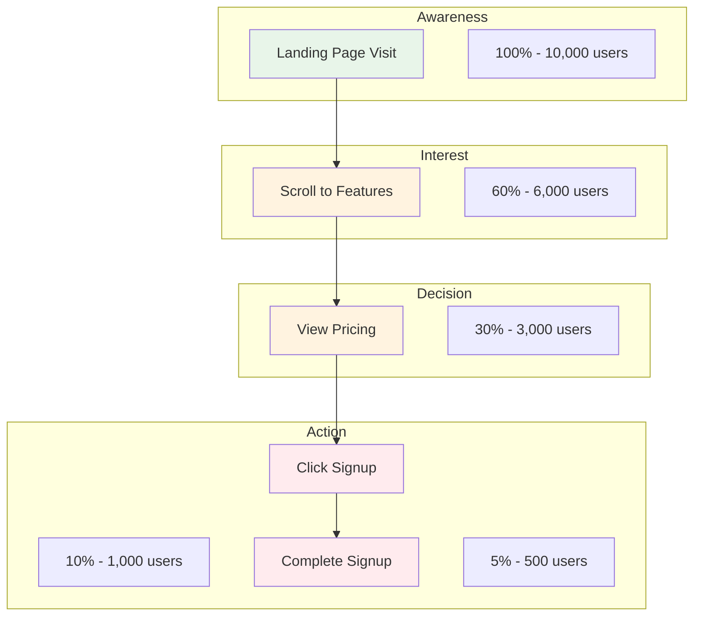
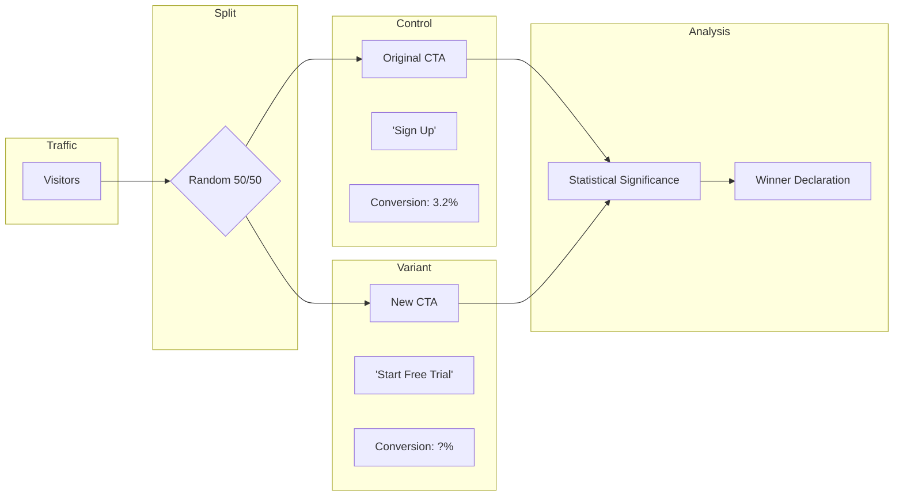
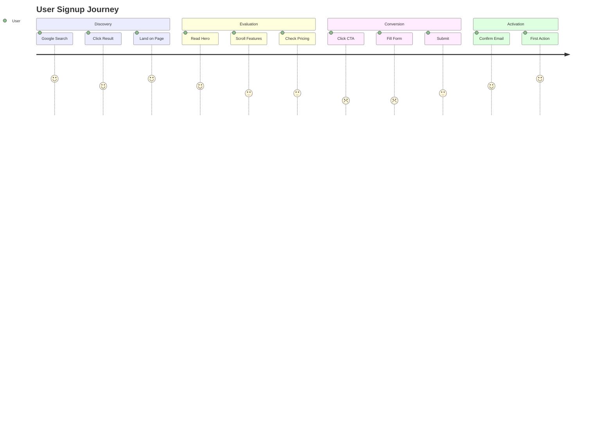

# growth — Canvas連携 詳細 (reference)

> Progressive Disclosure: SKILL.md から抽出 (ARIS-1577 #2)。必要時に Read する。

## CANVAS INTEGRATION

### Conversion Funnel Diagram Request

```
/Canvas create conversion funnel diagram:
- Stages: [Awareness, Interest, Decision, Action]
- Drop-off rates at each stage
- Key metrics per stage
- Optimization opportunities
```

### User Flow Diagram Request

```
/Canvas create user flow diagram for [feature]:
- Entry points
- Decision points
- Conversion paths
- Exit points
- Friction points to optimize
```

### A/B Test Design Diagram Request

```
/Canvas create A/B test diagram:
- Control vs Variant
- Hypothesis
- Primary/secondary metrics
- Sample size requirements
- Test duration
```

### Canvas Output Examples

**Conversion Funnel (Mermaid):**


**A/B Test Design (Mermaid):**


**User Journey (Mermaid):**


---

