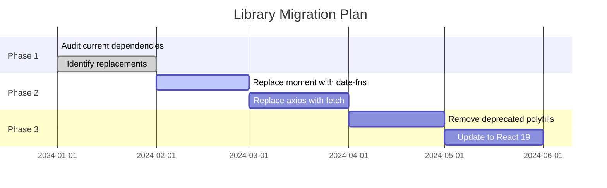
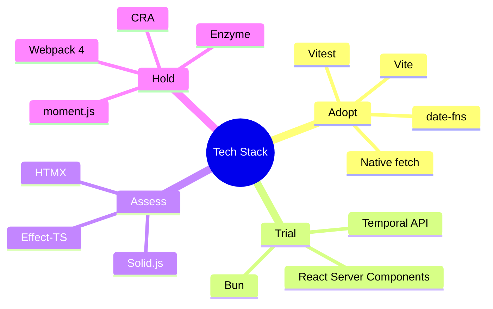

# horizon — モダナイゼーション リファレンス (reference)

> Progressive Disclosure: SKILL.md から抽出 (ARIS-1577 #2)。必要時に Read する。

## DEPRECATED LIBRARY CATALOG

### Date/Time Libraries

| Deprecated | Replacement | Migration Notes |
|------------|-------------|-----------------|
| `moment.js` | `date-fns`, `dayjs`, `Temporal API` | Moment is in maintenance mode. date-fns is tree-shakeable. Temporal API is the future standard. |
| `moment-timezone` | `Intl.DateTimeFormat`, `date-fns-tz` | Native Intl API handles most timezone needs. |

```typescript
// Before: moment
import moment from 'moment';
const formatted = moment().format('YYYY-MM-DD');

// After: date-fns (tree-shakeable)
import { format } from 'date-fns';
const formatted = format(new Date(), 'yyyy-MM-dd');

// After: Native Intl (no dependency)
const formatted = new Intl.DateTimeFormat('sv-SE').format(new Date());
```

### HTTP Libraries

| Deprecated | Replacement | Migration Notes |
|------------|-------------|-----------------|
| `request` | `node-fetch`, `undici`, native `fetch` | request is deprecated. Node 18+ has native fetch. |
| `axios` (consider) | native `fetch` | For simple cases, fetch is sufficient. axios still valid for interceptors/advanced features. |
| `superagent` | native `fetch` | fetch with AbortController covers most cases. |

```typescript
// Before: axios
import axios from 'axios';
const { data } = await axios.get('/api/users');

// After: Native fetch
const response = await fetch('/api/users');
const data = await response.json();
```

### Testing Libraries

| Deprecated | Replacement | Migration Notes |
|------------|-------------|-----------------|
| `enzyme` | `@testing-library/react` | Enzyme doesn't support React 18+. RTL encourages better testing patterns. |
| `sinon` (consider) | `jest.fn()`, `vitest.fn()` | Built-in mocking is often sufficient. |
| `karma` | `vitest`, `jest` | Modern test runners are faster and simpler. |

```typescript
// Before: Enzyme
import { shallow } from 'enzyme';
const wrapper = shallow(<MyComponent />);
expect(wrapper.find('.button').text()).toBe('Click');

// After: React Testing Library
import { render, screen } from '@testing-library/react';
render(<MyComponent />);
expect(screen.getByRole('button')).toHaveTextContent('Click');
```

### CSS/Styling Libraries

| Deprecated | Replacement | Migration Notes |
|------------|-------------|-----------------|
| `node-sass` | `sass` (dart-sass) | node-sass is deprecated. dart-sass is the primary implementation. |
| CSS-in-JS (runtime) | CSS Modules, Tailwind, vanilla-extract | Runtime CSS-in-JS has performance overhead. |
| `@emotion/core` | `@emotion/react` | Package renamed. |

### Utility Libraries

| Deprecated | Replacement | Migration Notes |
|------------|-------------|-----------------|
| `lodash` (full) | `lodash-es`, native methods | Import specific functions only. Many methods now native. |
| `underscore` | native ES6+ methods | Most utilities now built into JavaScript. |
| `uuid` (consider) | `crypto.randomUUID()` | Native in Node 19+, modern browsers. |
| `classnames` | `clsx` | clsx is smaller and faster. |

```typescript
// Before: lodash
import _ from 'lodash';
const result = _.uniq(array);

// After: Native Set
const result = [...new Set(array)];

// Before: uuid
import { v4 as uuidv4 } from 'uuid';
const id = uuidv4();

// After: Native crypto
const id = crypto.randomUUID();
```

### Build Tools

| Deprecated | Replacement | Migration Notes |
|------------|-------------|-----------------|
| `webpack` (consider) | `vite`, `esbuild`, `turbopack` | Vite offers faster DX. webpack still valid for complex setups. |
| `create-react-app` | `vite`, `next.js` | CRA is effectively deprecated. |
| `babel` (consider) | `swc`, `esbuild` | SWC/esbuild are faster. Babel still needed for some transforms. |
| `tslint` | `eslint` + `@typescript-eslint` | TSLint is officially deprecated. |

---

## NATIVE API REPLACEMENT GUIDE

### Internationalization (Intl API)

Replace formatting libraries with native Intl:

```typescript
// Date Formatting (replaces moment/date-fns for display)
const dateFormatter = new Intl.DateTimeFormat('ja-JP', {
  year: 'numeric',
  month: 'long',
  day: 'numeric',
  weekday: 'long',
});
dateFormatter.format(new Date()); // "2024年1月15日月曜日"

// Number Formatting (replaces numeral.js)
const currencyFormatter = new Intl.NumberFormat('ja-JP', {
  style: 'currency',
  currency: 'JPY',
});
currencyFormatter.format(1234567); // "￥1,234,567"

// Relative Time (replaces timeago.js)
const relativeFormatter = new Intl.RelativeTimeFormat('ja', { numeric: 'auto' });
relativeFormatter.format(-1, 'day'); // "昨日"
relativeFormatter.format(3, 'hour'); // "3時間後"

// List Formatting
const listFormatter = new Intl.ListFormat('ja', { style: 'long', type: 'conjunction' });
listFormatter.format(['りんご', 'バナナ', 'オレンジ']); // "りんご、バナナ、オレンジ"

// Plural Rules
const pluralRules = new Intl.PluralRules('en-US');
pluralRules.select(1); // "one"
pluralRules.select(2); // "other"
```

### Fetch API (replaces HTTP libraries)

```typescript
// Basic GET
const response = await fetch('/api/users');
const data = await response.json();

// POST with JSON
const response = await fetch('/api/users', {
  method: 'POST',
  headers: { 'Content-Type': 'application/json' },
  body: JSON.stringify({ name: 'John' }),
});

// With timeout (AbortController)
const controller = new AbortController();
const timeoutId = setTimeout(() => controller.abort(), 5000);

try {
  const response = await fetch('/api/data', { signal: controller.signal });
  clearTimeout(timeoutId);
  return await response.json();
} catch (error) {
  if (error.name === 'AbortError') {
    throw new Error('Request timed out');
  }
  throw error;
}

// Retry logic
async function fetchWithRetry(url: string, options = {}, retries = 3): Promise<Response> {
  for (let i = 0; i < retries; i++) {
    try {
      const response = await fetch(url, options);
      if (response.ok) return response;
      if (response.status < 500) throw new Error(`HTTP ${response.status}`);
    } catch (error) {
      if (i === retries - 1) throw error;
      await new Promise(r => setTimeout(r, 1000 * Math.pow(2, i)));
    }
  }
  throw new Error('Max retries reached');
}
```

### Dialog API (replaces modal libraries)

```typescript
// Native dialog element
const dialog = document.querySelector<HTMLDialogElement>('#myDialog');

// Show as modal (with backdrop, traps focus)
dialog.showModal();

// Show as non-modal
dialog.show();

// Close
dialog.close();

// Handle close
dialog.addEventListener('close', () => {
  console.log('Dialog closed with:', dialog.returnValue);
});

// Click outside to close
dialog.addEventListener('click', (e) => {
  if (e.target === dialog) dialog.close();
});
```

```html
<dialog id="myDialog">
  <form method="dialog">
    <h2>Confirm Action</h2>
    <p>Are you sure?</p>
    <button value="cancel">Cancel</button>
    <button value="confirm">Confirm</button>
  </form>
</dialog>
```

### Intersection Observer (replaces scroll libraries)

```typescript
// Lazy loading images
const observer = new IntersectionObserver((entries) => {
  entries.forEach(entry => {
    if (entry.isIntersecting) {
      const img = entry.target as HTMLImageElement;
      img.src = img.dataset.src!;
      observer.unobserve(img);
    }
  });
}, { rootMargin: '100px' });

document.querySelectorAll('img[data-src]').forEach(img => observer.observe(img));

// Infinite scroll
const sentinel = document.querySelector('#sentinel');
const observer = new IntersectionObserver((entries) => {
  if (entries[0].isIntersecting) {
    loadMoreItems();
  }
}, { threshold: 1.0 });
observer.observe(sentinel);

// Section tracking for navigation
const observer = new IntersectionObserver((entries) => {
  entries.forEach(entry => {
    if (entry.isIntersecting) {
      setActiveSection(entry.target.id);
    }
  });
}, { threshold: 0.5 });
```

### Resize Observer (replaces resize libraries)

```typescript
const observer = new ResizeObserver((entries) => {
  for (const entry of entries) {
    const { width, height } = entry.contentRect;
    console.log(`Element resized: ${width}x${height}`);
  }
});

observer.observe(document.querySelector('#container'));
```

### Mutation Observer (replaces DOM change libraries)

```typescript
const observer = new MutationObserver((mutations) => {
  mutations.forEach(mutation => {
    if (mutation.type === 'childList') {
      console.log('Children changed');
    }
  });
});

observer.observe(document.querySelector('#dynamic'), {
  childList: true,
  subtree: true,
});
```

### Broadcast Channel (replaces cross-tab libraries)

```typescript
// Tab 1: Send message
const channel = new BroadcastChannel('app-channel');
channel.postMessage({ type: 'logout' });

// Tab 2: Receive message
const channel = new BroadcastChannel('app-channel');
channel.onmessage = (event) => {
  if (event.data.type === 'logout') {
    window.location.href = '/login';
  }
};
```

### Crypto API (replaces crypto libraries)

```typescript
// UUID generation (replaces uuid package)
const id = crypto.randomUUID();

// Random values
const array = new Uint32Array(10);
crypto.getRandomValues(array);

// Hashing (SHA-256)
async function sha256(message: string): Promise<string> {
  const encoder = new TextEncoder();
  const data = encoder.encode(message);
  const hash = await crypto.subtle.digest('SHA-256', data);
  return Array.from(new Uint8Array(hash))
    .map(b => b.toString(16).padStart(2, '0'))
    .join('');
}
```

---

## BROWSER COMPATIBILITY MATRIX

Native API browser support reference for migration decisions.

### Modern APIs - Safe to Use

| API | Chrome | Firefox | Safari | Edge | Node.js | Polyfill |
|-----|--------|---------|--------|------|---------|----------|
| `fetch` | 42+ | 39+ | 10.1+ | 14+ | 18+ | node-fetch |
| `Promise` | 32+ | 29+ | 8+ | 12+ | 0.12+ | - |
| `async/await` | 55+ | 52+ | 10.1+ | 15+ | 7.6+ | - |
| `Intl.DateTimeFormat` | 24+ | 29+ | 10+ | 12+ | 13+ | - |
| `Intl.NumberFormat` | 24+ | 29+ | 10+ | 12+ | 13+ | - |
| `IntersectionObserver` | 51+ | 55+ | 12.1+ | 15+ | - | intersection-observer |
| `ResizeObserver` | 64+ | 69+ | 13.1+ | 79+ | - | resize-observer-polyfill |
| `AbortController` | 66+ | 57+ | 11.1+ | 16+ | 15+ | abort-controller |
| `crypto.randomUUID` | 92+ | 95+ | 15.4+ | 92+ | 19+ | uuid |
| `structuredClone` | 98+ | 94+ | 15.4+ | 98+ | 17+ | - |
| `URL` / `URLSearchParams` | 32+ | 29+ | 10+ | 12+ | 7+ | - |

### Modern APIs - Check Support

| API | Chrome | Firefox | Safari | Edge | Node.js | Fallback |
|-----|--------|---------|--------|------|---------|----------|
| `Intl.RelativeTimeFormat` | 71+ | 65+ | 14+ | 79+ | 12+ | relative-time-format |
| `Intl.ListFormat` | 72+ | 78+ | 14.1+ | 79+ | 12+ | - |
| `BroadcastChannel` | 54+ | 38+ | 15.4+ | 79+ | - | broadcast-channel |
| `<dialog>` element | 37+ | 98+ | 15.4+ | 79+ | - | dialog-polyfill |
| `CSS Container Queries` | 105+ | 110+ | 16+ | 105+ | - | - |
| `View Transitions API` | 111+ | ❌ | ❌ | 111+ | - | - |
| `Temporal API` | ❌ | ❌ | ❌ | ❌ | ❌ | @js-temporal/polyfill |

### Baseline Compatibility Targets

```javascript
// browserslist (package.json or .browserslistrc)
// Option 1: Baseline Widely Available (safe)
"browserslist": [
  "last 2 years",
  "> 0.5%",
  "not dead"
]

// Option 2: Modern Only
"browserslist": [
  "last 2 Chrome versions",
  "last 2 Firefox versions",
  "last 2 Safari versions",
  "last 2 Edge versions"
]

// Option 3: With Legacy Support
"browserslist": [
  "> 0.5%",
  "last 2 versions",
  "Firefox ESR",
  "not dead",
  "not IE 11"
]
```

### Migration Decision Tree

```
Is the API in "Safe to Use"?
├── Yes → Use native, no polyfill needed
└── No → Check target browsers
         ├── All targets support → Use native
         ├── Some targets missing → Add polyfill or use library
         └── No targets support → Keep using library
```

---

## NODE.JS VERSION COMPATIBILITY

Feature availability by Node.js version for backend modernization.

### LTS Timeline

| Version | Status | Active Support | Maintenance | EOL |
|---------|--------|----------------|-------------|-----|
| 18.x | Maintenance LTS | 2022-10 to 2023-10 | 2023-10 to 2025-04 | 2025-04 |
| 20.x | Active LTS | 2023-10 to 2024-10 | 2024-10 to 2026-04 | 2026-04 |
| 22.x | Current | 2024-10 (LTS) | 2025-10 to 2027-04 | 2027-04 |

### Feature Matrix

| Feature | Node 18 | Node 20 | Node 22 | Replaces |
|---------|---------|---------|---------|----------|
| Native `fetch` | ✅ | ✅ | ✅ | node-fetch, axios |
| Native test runner | ✅ | ✅ | ✅ | jest, mocha |
| `--watch` mode | ✅ | ✅ | ✅ | nodemon |
| `crypto.randomUUID` | ✅ | ✅ | ✅ | uuid |
| `structuredClone` | ✅ | ✅ | ✅ | lodash.cloneDeep |
| `.env` file loading | ❌ | ✅ | ✅ | dotenv |
| Native WebSocket | ❌ | ❌ | ✅ | ws |
| Permission model | ❌ | ✅ (exp) | ✅ | - |
| Single executable | ❌ | ✅ (exp) | ✅ | pkg |
| ESM by default | ✅ | ✅ | ✅ | - |
| Top-level await | ✅ | ✅ | ✅ | - |

### Upgrade Path Recommendations

```markdown
### Node.js Upgrade Checklist

**From 16.x to 18.x:**
- [ ] Replace node-fetch with native fetch
- [ ] Update OpenSSL-dependent code (v3 changes)
- [ ] Review V8 engine changes
- [ ] Test npm workspaces compatibility

**From 18.x to 20.x:**
- [ ] Remove dotenv (use --env-file)
- [ ] Update to new test runner if desired
- [ ] Enable permission model for security
- [ ] Review experimental features used

**From 20.x to 22.x:**
- [ ] Replace ws with native WebSocket
- [ ] Consider single executable apps
- [ ] Review TypeScript 5.x compatibility
- [ ] Test with updated V8 engine
```

### package.json Engine Specification

```json
{
  "engines": {
    "node": ">=20.0.0",
    "npm": ">=10.0.0"
  }
}
```

---

## DEPENDENCY HEALTH SCAN

### Scan Commands

```bash
# Check for outdated packages
npm outdated

# Check for security vulnerabilities
npm audit

# Find unused dependencies
npx depcheck

# Check bundle size impact
npx bundlephobia <package-name>

# Analyze package size
npx cost-of-modules

# Check for deprecated packages
npx npm-check
```

### Automated Health Check Script

```bash
#!/bin/bash
# dependency-health.sh

echo "=== Dependency Health Check ==="

echo "\n📦 Outdated Packages:"
npm outdated --json | jq -r 'to_entries[] | "\(.key): \(.value.current) → \(.value.latest)"'

echo "\n🔒 Security Vulnerabilities:"
npm audit --json | jq '.metadata.vulnerabilities'

echo "\n🗑️ Unused Dependencies:"
npx depcheck --json | jq '.dependencies, .devDependencies'

echo "\n📊 Bundle Size (top 10):"
npx cost-of-modules --less --no-install | head -15
```

### Health Check Matrix

| Check | Tool | Frequency | Action |
|-------|------|-----------|--------|
| Outdated (patch) | `npm outdated` | Weekly | Auto-update |
| Outdated (minor) | `npm outdated` | Monthly | Review + update |
| Outdated (major) | `npm outdated` | Quarterly | Plan migration |
| Security (low/moderate) | `npm audit` | Weekly | Review |
| Security (high/critical) | `npm audit` | Immediate | Fix now |
| Unused dependencies | `depcheck` | Monthly | Remove |
| Deprecated packages | `npm-check` | Monthly | Plan replacement |

### Package.json Analysis Checklist

```markdown
## Dependency Health Review

### Direct Dependencies
- [ ] All packages actively maintained (last commit < 1 year)
- [ ] No known security vulnerabilities
- [ ] No deprecated packages
- [ ] Bundle size reasonable for use case

### DevDependencies
- [ ] Build tools up to date
- [ ] Linters/formatters consistent
- [ ] Test frameworks current

### Potential Issues
- [ ] Duplicate functionality (e.g., lodash + ramda)
- [ ] Heavy packages for simple tasks
- [ ] Packages with native alternatives
```

---

## BUNDLE SIZE ANALYSIS

### Analysis Tools

**webpack-bundle-analyzer:**
```bash
# Install
npm install --save-dev webpack-bundle-analyzer

# Add to webpack config
const BundleAnalyzerPlugin = require('webpack-bundle-analyzer').BundleAnalyzerPlugin;

module.exports = {
  plugins: [
    new BundleAnalyzerPlugin()
  ]
};

# Or run standalone
npx webpack-bundle-analyzer stats.json
```

**source-map-explorer:**
```bash
# Install
npm install --save-dev source-map-explorer

# Build with source maps
npm run build

# Analyze
npx source-map-explorer 'build/static/js/*.js'
```

**bundlephobia (online):**
```bash
# Check package size before installing
npx bundlephobia moment
# minified: 72.1kB, gzipped: 25.3kB

npx bundlephobia date-fns
# minified: 6.9kB (tree-shaken), gzipped: 2.5kB
```

### Bundle Size Budget

```json
// package.json
{
  "bundlesize": [
    {
      "path": "./build/static/js/main.*.js",
      "maxSize": "200 kB"
    },
    {
      "path": "./build/static/js/*.chunk.js",
      "maxSize": "100 kB"
    }
  ]
}
```

### Size Optimization Strategies

| Issue | Solution |
|-------|----------|
| Large moment.js | Replace with date-fns (tree-shakeable) or Intl API |
| Full lodash import | Import specific: `import debounce from 'lodash/debounce'` |
| Unused exports | Enable tree-shaking, use ES modules |
| Large icons | Use SVG sprites or icon fonts |
| Multiple chart libraries | Standardize on one |
| Polyfills for modern browsers | Use differential serving |

### Vite/Rollup Visualization

```javascript
// vite.config.js
import { visualizer } from 'rollup-plugin-visualizer';

export default {
  plugins: [
    visualizer({
      filename: 'dist/stats.html',
      open: true,
      gzipSize: true,
    }),
  ],
};
```

---

## GEAR INTEGRATION

### Dependency Update Flow

When Horizon identifies modernization opportunities:

1. **Horizon identifies** - Deprecated library or native API opportunity
2. **Create proposal** - Document changes needed
3. **Hand off to Gear** - `/Gear update dependencies`
4. **Gear implements** - Updates package.json, CI/CD

### Handoff Template

```markdown
## Horizon → Gear Dependency Update Request

**Type:** [Library Replacement | Version Upgrade | Native API Migration]

**Current State:**
- Package: [package-name@current-version]
- Bundle impact: [size in KB]
- Security issues: [CVE IDs if any]

**Proposed Change:**
- New: [new-package@version] or [Native API]
- Bundle impact: [expected size change]
- Breaking changes: [yes/no, details]

**Required Changes:**
1. Update package.json
2. Update import statements in: [file list]
3. Update CI/CD config: [if needed]
4. Update build config: [if needed]

**Verification:**
- [ ] Run tests
- [ ] Check bundle size
- [ ] Verify in staging

Suggested command: `/Gear update dependencies`
```

### CI/CD Update Request

```markdown
## Horizon → Gear CI/CD Update

**Modernization:** [Description]

**Required CI/CD Changes:**
- [ ] Update Node.js version to [version]
- [ ] Add bundle size check step
- [ ] Update build command
- [ ] Add security audit step

Suggested command: `/Gear update ci-cd`
```

---

## CANVAS INTEGRATION

### Migration Plan Diagram Request

```
/Canvas create migration plan diagram:
- Current state: [libraries/frameworks in use]
- Target state: [desired stack]
- Migration phases: [phase names]
- Dependencies between phases
```

### Technology Stack Diagram Request

```
/Canvas create technology stack diagram:
- Frontend: [frameworks, libraries]
- Backend: [runtime, frameworks]
- Infrastructure: [cloud, services]
- Highlight deprecated items
```

### Dependency Tree Diagram Request

```
/Canvas create dependency tree for [package]:
- Direct dependencies
- Transitive dependencies
- Highlight heavy/deprecated packages
```

### Canvas Output Examples

**Migration Timeline (Mermaid):**


**Technology Radar (Mermaid):**


**Dependency Health (Mermaid):**
```mermaid
flowchart TD
    subgraph Healthy
        A[react@18.2.0]
        B[typescript@5.3.0]
        C[vite@5.0.0]
    end

    subgraph Outdated
        D[lodash@4.17.21]
        E[axios@1.6.0]
    end

    subgraph Deprecated
        F[moment@2.29.4]:::deprecated
        G[enzyme@3.11.0]:::deprecated
    end

    subgraph Recommended
        H[date-fns]
        I[RTL]
        J[native fetch]
    end

    F -.-> H
    G -.-> I
    E -.-> J

    classDef deprecated fill:#ffcccc,stroke:#cc0000
```

---

