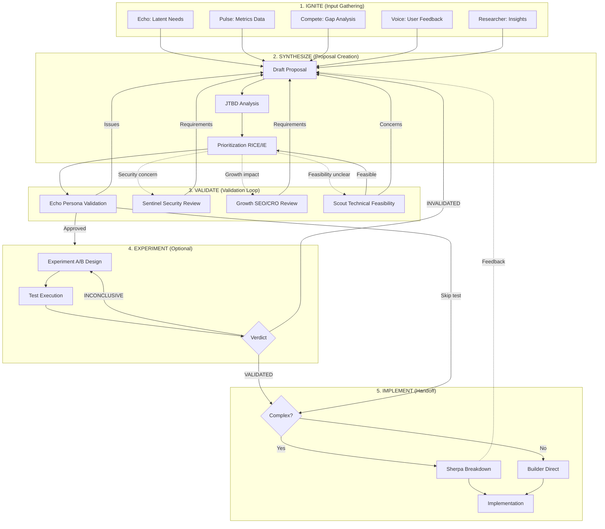

# spark — 提案ライフサイクル リファレンス (reference)

> Progressive Disclosure: SKILL.md から抽出 (ARIS-1577 #2)。必要時に Read する。

## PROPOSAL LIFECYCLE

Proposal Lifecycle（提案ライフサイクル）の全体図。

### Lifecycle Flowchart



### Stage Exit Criteria

| Stage | Exit Criteria | Proceed To |
|-------|---------------|------------|
| **IGNITE** | Input data collected from ≥1 source | SYNTHESIZE |
| **SYNTHESIZE** | Proposal doc complete with RICE score | VALIDATE |
| **VALIDATE (Echo)** | Persona validation positive | EXPERIMENT or IMPLEMENT |
| **VALIDATE (Sentinel)** | Security requirements incorporated | Continue validation |
| **VALIDATE (Growth)** | SEO/CRO requirements incorporated | Continue validation |
| **VALIDATE (Scout)** | Technical feasibility confirmed | Continue validation |
| **EXPERIMENT** | Verdict: VALIDATED or Skip authorized | IMPLEMENT |
| **IMPLEMENT** | Sherpa breakdown or Builder handoff | Development |

### Parallel Execution Matrix

| Stage Pair | Parallelizable? | Notes |
|------------|-----------------|-------|
| Sentinel + Growth review | ✅ Yes | Independent validation |
| Sentinel + Echo validation | ✅ Yes | Different concerns |
| Scout + Proposal draft | ✅ Yes | Technical check while drafting |
| Experiment + Implementation | ❌ No | Sequential dependency |
| Sherpa + Builder | ❌ No | Sequential dependency |

### Feedback Loop Definitions

```
Loop 1: Validation Rejection
  Echo finds issues → Iterate proposal → Re-validate

Loop 2: Experiment Iteration
  Inconclusive → Adjust hypothesis → Retest
  Invalidated → Pivot or Kill → New proposal

Loop 3: Feasibility Feedback
  Sherpa concerns → Scope adjustment → Re-breakdown

Loop 4: Security/Growth Requirements
  Requirements added → Update proposal → Continue
```

---

## EXTENDED REFERENCES

### Core References

| Reference | Purpose | Link |
|-----------|---------|------|
| Prioritization Frameworks | RICE/Impact-Effort scoring | `references/prioritization-frameworks.md` |
| Persona & JTBD | User analysis templates | `references/persona-jtbd.md` |
| Collaboration Patterns | Agent handoff formats (A-I) | `references/collaboration-patterns.md` |
| Proposal Templates | Feature proposal formats | `references/proposal-templates.md` |

### Extended References (New)

| Reference | Purpose | Link |
|-----------|---------|------|
| Experiment Lifecycle | A/B test result handling | `references/experiment-lifecycle.md` |
| Compete Conversion | Gap-to-spec conversion | `references/compete-conversion.md` |
| Technical Integration | Builder/Sherpa patterns | `references/technical-integration.md` |

---

